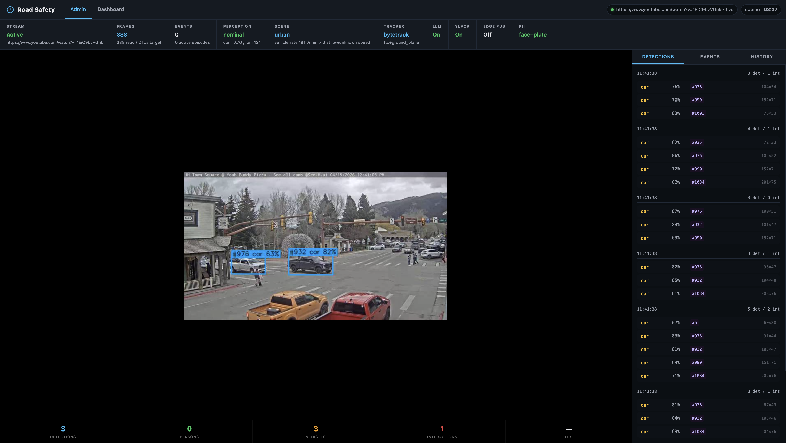
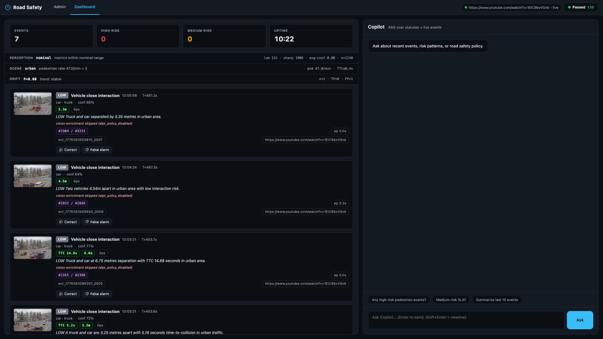
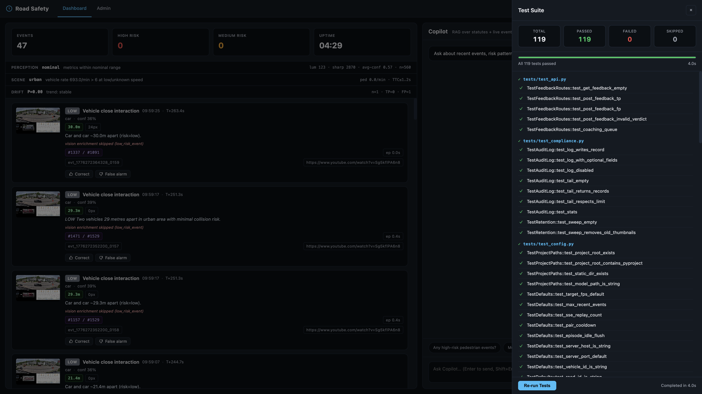

# Road Safety

Production-focused road safety monitoring demo centered on the hardest parts of deployment: reliable risk detection, edge latency, LLM resilience, privacy, drift monitoring, and fleet-scale operations.

---

## Screenshots







---

## Challenges & How We Address Them

This README focuses on the operational challenges behind fleet safety systems and the concrete engineering decisions used to address them.

### 1. False Positives & Alert Fatigue

Fleet safety managers report spending 30-60 minutes daily sorting false alerts from genuine incidents. When systems cry wolf repeatedly, drivers and managers stop trusting the technology — and the safety value drops to zero. This is consistently reported as the #1 operational problem across the fleet safety industry by vendors like Netradyne, Lytx, and GoMotive.

**Our approach: layered gating where a real conflict satisfies all layers and noise fails at the first.**

| Layer | What it does |
|---|---|
| **Multi-gate TTC** | Time-to-collision fires only after 5 independent gates: ≥4-sample window spanning ≥1.5s, monotonic bbox growth, jitter-floor pixel delta, non-trivial track motion, and scale ratio above noise floor. Pair-TTC adds monotonic distance decrease and minimum closing rate. Based on FHWA's Surrogate Safety Assessment Model (SSAM) conflict methodology. |
| **Ego-motion gating** | TTC is discarded when neither track shows approach residual against optical-flow ego-motion. Bbox jitter on stationary objects cannot fire alarms. |
| **Depth-aware proximity** | Vehicle interactions are gated on monocular 3D depth difference, not image-plane overlap. Distant cars whose bboxes overlap due to perspective are not flagged. |
| **Scene-adaptive thresholds** | Urban / highway / parking classification rescales TTC and distance bands dynamically. Highway widens for reaction time; parking tightens for close-quarters. |
| **Sustained-risk episodes** | Track-pair interactions accumulate into episodes. Peak risk is downgraded if not sustained over ≥2 frames and ≥1.0s. |
| **Perception-quality gating** | When the camera is degraded (low light, blur), thresholds tighten conservatively and low-confidence events are suppressed. |
| **Operator feedback loop** | Operators mark events tp/fp. Drift monitor tracks rolling precision and alerts on degradation. Disputed events feed active learning. |

### 2. Edge/Cloud Latency & Bandwidth

A single 1080p dashcam streaming continuously over 8 hours generates ~28 GB/day. A fleet of 1,000 vehicles would push 28 TB daily over cellular — economically impossible. Even event-based recording produces 1-2 GB/day/camera. Real-time safety requires sub-second latency, but cloud round-trips add 30-80ms on 4G LTE.

**Our approach: all perception runs on-device. Only typed JSON (~2 KB) + redacted thumbnails (~8 KB) cross the wire.**

| Layer | What it does |
|---|---|
| **Edge-first architecture** | Detection, tracking, risk classification, and PII redaction run on-device. Cloud receives only structured events. |
| **Lightweight model** | YOLOv8n (nano) — smallest YOLO variant, runs at 2 fps on laptop CPU. On dedicated edge hardware (Jetson Orin NX) it exceeds 100 fps with TensorRT. |
| **HMAC-signed batched delivery** | Events queue locally in append-only JSONL. Batches of up to 20 are signed and POSTed together. Survives network outages with exponential backoff. |
| **Selective LLM enrichment** | Vision enrichment is skipped when perception is degraded or for low-risk events. No wasted API calls on low-value frames. |

### 3. LLM Reliability in Production

LLM integration in safety systems faces compounding risks: rate limiting degrades service, vision models hallucinate on degraded inputs, costs scale linearly with event volume, and single-provider outages take down the AI layer. Research shows multimodal LLMs generate hallucinatory content when visual input is ambiguous — particularly problematic for OCR tasks like plate reading.

**Our approach: the LLM is an enrichment layer, not a critical path. Detection works with zero LLM calls. Narration adds value when available and degrades silently when not.**

| Layer | What it does |
|---|---|
| **Multi-provider failover** | Anthropic ↔ Azure OpenAI automatic fallback on errors. |
| **Client-side rate budget** | Token-bucket limiter refuses calls *before* triggering 429 errors. Cheaper and faster than handling rate-limit failures. |
| **Circuit breaker** | After 3 consecutive failures, breaker opens for 60s, halving API load during storms. |
| **Self-consistency ALPR** | Two independent vision calls at different temperatures. If plate readings disagree, output is null rather than hallucinated. |
| **Cost observability** | Every call instrumented: tokens, latency, USD cost, success/failure. Exposed via `/api/llm/stats`. |

### 4. Privacy & Regulatory Compliance (GDPR/CCPA)

Road cameras capture faces, license plates, and location — all classified as personal data under GDPR and CCPA. GDPR enforcement has exceeded €5.8 billion in cumulative fines across 2,245+ actions since 2018, with individual penalties reaching €1.2 billion. License plates are explicitly treated as personal data by the UK ICO and EU data protection authorities because they link to identifiable vehicle owners and enable tracking profiles.

**Our approach: privacy by design, not by policy. Raw PII never reaches an external channel by construction — the code path makes it structurally impossible.**

| Layer | What it does |
|---|---|
| **Dual thumbnails** | Every event produces internal (unredacted, local-only) and public (faces + plates blurred) versions. All external channels receive only the public version. |
| **Plate hashing** | Raw plate text is immediately converted to a salted SHA-256 hash. Enables cross-event correlation without storing actual plates. |
| **DSAR-gated access** | Unredacted thumbnails require an `X-DSAR-Token` header. Denied attempts are audit-logged. |
| **Audit trail** | Every sensitive access is logged: timestamp, actor, action, resource, outcome, IP. GDPR Art. 30 / SOC 2 ready. |
| **Automated retention** | Hourly sweeps delete data past configurable windows: thumbnails 30d, feedback 90d, active-learning 60d. GDPR Art. 5(1)(e) — data kept only as long as necessary. |

### 5. Model Drift & Continuous Improvement

Over 70% of organizations report experiencing substantial data drift within the first six months of deploying ML models to production. Weather changes, new camera angles, seasonal lighting — all cause distribution shift. Without monitoring, precision silently degrades. Retraining requires labeled data, which is expensive to collect and curate.

**Our approach: the feedback loop is a first-class feature. Operator verdicts flow directly into precision monitoring and training data selection.**

| Layer | What it does |
|---|---|
| **Rolling precision** | Joins operator feedback with emitted events. Computes precision sliced by risk level and event type. |
| **Trend detection** | Compares current window against prior non-overlapping window. Reports improving / stable / degrading. |
| **Active learning** | Events near the decision boundary (confidence 0.35-0.50) are sampled for relabeling. Disputed (fp-marked) events are always captured. |
| **Label tool export** | Pending samples bundle into zip with manifest JSON, ready for Label Studio / CVAT import. |

### 6. Scaling to Multi-Vehicle Fleets

The video telematics market reached ~6 million active units in North America alone in 2024, projected to hit 17 million by 2029. Scaling from a single camera to fleet-wide operations requires vehicle identity, road-wide aggregation, and driver scoring from day one — retrofitting these after deployment is costly.

**Our approach: single-vehicle and multi-vehicle deployments use the same data model. Adding vehicles is a configuration change, not a code change.**

| Layer | What it does |
|---|---|
| **Vehicle/road identity** | Every event carries `vehicle_id`, `road_id`, `driver_id`. Events are attributable from creation. |
| **Driver scoring** | Decaying penalty model: high-risk events deduct 10 points from max 100. Scores recover over time. |
| **Road-wide aggregation** | `/api/road/summary` provides aggregate counts. `/api/road/drivers` ranks drivers worst-first. |
| **Edge/cloud split** | Each vehicle runs its own edge node. Events flow to a central cloud receiver via HMAC-signed HTTPS with event_id deduplication. |

### 7. AI Agent Orchestration

Enterprise AI agent projects have high failure rates — recent industry analyses report 40-85% of agentic AI pilots stall before reaching production. Key failure drivers include orchestration complexity, context management failures, and tool overload where agents burdened with large tool catalogs hallucinate parameters.

**Our approach: single-responsibility agents with bounded tool sets. No agent has more than 5 tools. Agents recommend — operators decide.**

| Layer | What it does |
|---|---|
| **Coaching agent** | Retrieves event + road policy, generates structured coaching note with specific driver action items. |
| **Investigation agent** | Correlates event with similar events, feedback, and drift data. Produces root-cause hypothesis with confidence. |
| **Report agent** | Queries event counts, feedback, and drift across the session. Produces structured safety summary. |
| **Hard stops** | Max 5 iteration steps. Returns with what it has rather than looping indefinitely. |
| **Observability** | Agent LLM calls instrumented with same cost/latency tracking. Invocations audit-logged. |

---

## Summary

| Challenge | Industry Pain | Our Approach |
|---|---|---|
| False positives | Alert fatigue, driver distrust | 7-layer gating: TTC gates, ego-motion, depth, scene-adaptive, episodes, perception quality, feedback |
| Edge/cloud bandwidth | 28 GB/day/camera continuous | Edge-first processing, only event metadata crosses the wire |
| LLM reliability | Rate limits, hallucination, cost | Multi-provider failover, circuit breaker, self-consistency, rate budget |
| Privacy compliance | €5.8B+ in GDPR fines since 2018 | Dual thumbnails, plate hashing, DSAR gating, audit trail, auto-retention |
| Model drift | 70%+ of orgs hit drift in 6 months | Rolling precision, trend detection, active learning, disputed sampling |
| Fleet scaling | 6M+ active units in NA alone | Vehicle/road identity, driver scoring, road-wide aggregation |
| Agent orchestration | 40-85% pilot failure rate | Bounded tools, structured output, hard stops, observability |

---

## Quick start

```bash
git clone <repo-url> && cd road-safety
python3 -m venv .venv && source .venv/bin/activate
pip install -e ".[dev]"
cp .env.example .env
python start.py
```

Or with Docker: `docker compose up --build`

---

## Testing

```bash
make test    # or: pytest tests/ -v
```

119 tests covering detection pipeline, services, API routes, compliance, and integrations.

## License

MIT — see [LICENSE](LICENSE).
