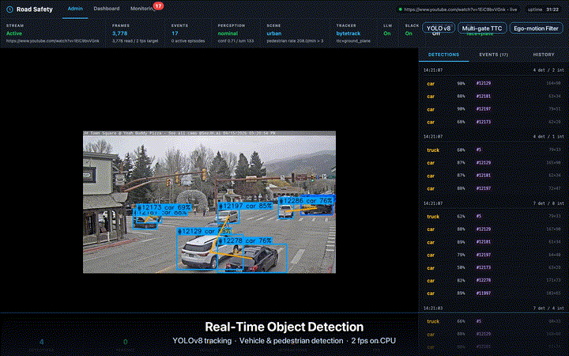
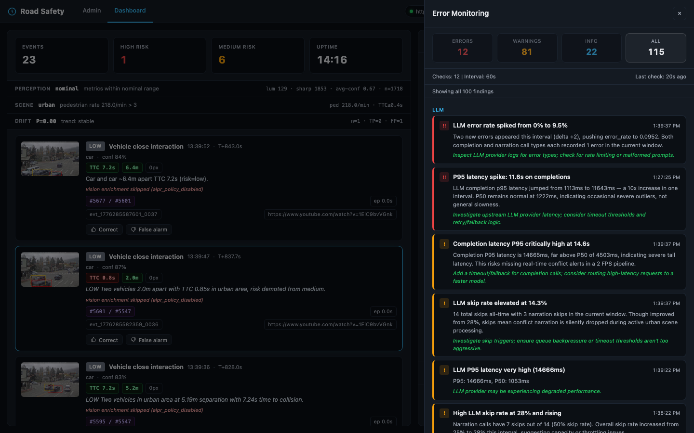

# Road Safety

Real-time road-conflict detection for fleet dashcams. Analyzes live video streams with YOLO tracking to catch vehicle-vehicle and vehicle-pedestrian near-misses — then scores risk, redacts PII, and pushes structured events to the cloud.

Built for the hard parts of production: suppressing false positives without missing real incidents, running entirely on-device over cellular, surviving LLM outages gracefully, staying GDPR/CCPA-compliant by default, and catching model drift before it goes silent.

This is a **building block** for fleet safety platforms, not a complete commercial product. DMS, clip export, telematics fusion, and ELD are deliberately out of scope — see [`docs/challenges.md §8`](docs/challenges.md#8-out-of-scope-deliberately) for what's missing and how to extend.



---

## Main Features

- **On-device perception** — YOLO tracking, multi-gate TTC, depth-aware proximity, and scene-adaptive thresholds keep false positives low without missing real conflicts.
- **Privacy by default** — dual thumbnails (internal + redacted), structural plate hashing at the LLM boundary, DSAR-gated access, and automated retention sweeps.
- **Resilient LLM layer** — Anthropic ↔ Azure failover, token-bucket rate budget, circuit breaker, self-consistency ALPR, and per-call cost/latency observability.
- **Edge → cloud delivery** — HMAC-signed batched JSONL with exponential backoff; only typed events and redacted thumbnails cross the wire.
- **Drift monitoring** — rolling precision sliced by risk/type, feedback-coverage metric to guard against selection bias, and active-learning sampling near the decision boundary.
- **Fleet-ready identity** — every event carries `vehicle_id` / `road_id` / `driver_id`, with driver scoring and road-wide aggregation endpoints.
- **Incident-queue watchdog** — findings grouped into fingerprinted incidents with impact, likely cause, owner, evidence, investigation steps, and ready-to-run debug commands.
- **Operator-assist agents** — coaching, investigation, and reporting agents with bounded tool sets (≤5), hard iteration stops, and audit-logged invocations.
- **Full audit trail** — every sensitive access logged with actor, resource, outcome, and IP — GDPR Art. 30 / SOC 2 ready.

---

## Screenshots





---

## Monitoring Philosophy

The watchdog is designed to be an **incident queue**, not a wall of red text. Repeated findings are grouped into incident fingerprints, and each incident carries operator impact, likely cause, ownership hint, evidence, investigation steps, and fast debug commands. The goal is to shorten the path from “something looks wrong” to “I know exactly what to inspect next.”

---

## Challenges & How We Address Them

### 1. False Positives & Alert Fatigue

Fleet safety managers report spending 30-60 minutes daily sorting false alerts from genuine incidents. When systems cry wolf repeatedly, drivers and managers stop trusting the technology — and the safety value drops to zero. This is consistently reported as the #1 operational problem across the fleet safety industry by vendors like Netradyne, Lytx, and GoMotive.

**Our approach: layered gating where a real conflict satisfies all layers and noise fails at the first.**

| Layer | What it does |
|---|---|
| **Multi-gate TTC** | Time-to-collision fires only after 5 independent gates: ≥4-sample window spanning ≥1.5s, monotonic bbox growth, jitter-floor pixel delta, non-trivial track motion, and scale ratio above noise floor. Pair-TTC adds monotonic distance decrease and minimum closing rate. Based on FHWA's Surrogate Safety Assessment Model (SSAM) conflict methodology. |
| **Ego-motion gating** | TTC is discarded when neither track shows approach residual against optical-flow ego-motion. Bbox jitter on stationary objects cannot fire alarms. |
| **Depth-aware proximity** | Vehicle interactions are gated on monocular 3D depth difference, not image-plane overlap. Distant cars whose bboxes overlap due to perspective are not flagged. |
| **Scene-adaptive thresholds** | Urban / highway / parking classification rescales TTC and distance bands dynamically. Highway widens for reaction time; parking tightens for close-quarters. |
| **Sustained-risk episodes** | Track-pair interactions accumulate into episodes. Peak risk is downgraded if not sustained over ≥2 frames and ≥1.0s. |
| **Perception-quality gating** | When the camera is degraded (low light, blur), thresholds tighten conservatively and low-confidence events are suppressed. |
| **Operator feedback loop** | Operators mark events tp/fp. Drift monitor tracks rolling precision and alerts on degradation. Disputed events feed active learning. |

### 2. Edge/Cloud Latency & Bandwidth

A single 1080p dashcam streaming continuously over 8 hours generates ~28 GB/day. A fleet of 1,000 vehicles would push 28 TB daily over cellular — economically impossible. Even event-based recording produces 1-2 GB/day/camera. Real-time safety requires sub-second latency, but cloud round-trips add 30-80ms on 4G LTE.

**Our approach: all perception runs on-device. Only typed JSON (~2 KB) + redacted thumbnails (~8 KB) cross the wire.**

| Layer | What it does |
|---|---|
| **Edge-first architecture** | Detection, tracking, risk classification, and PII redaction run on-device. Cloud receives only structured events. |
| **Lightweight model** | YOLOv8n (nano) — smallest YOLO variant, runs at 2 fps on laptop CPU. On dedicated edge hardware (Jetson Orin NX) it exceeds 100 fps with TensorRT. |
| **HMAC-signed batched delivery** | Events queue locally in append-only JSONL. Batches of up to 20 are signed and POSTed together. Survives network outages with exponential backoff. |
| **Selective LLM enrichment** | Vision enrichment is policy-gated (`ROAD_ALPR_MODE=third_party`) and additionally skipped when perception is degraded or for low-risk events. No wasted API calls on low-value frames. |

### 3. LLM Reliability in Production

LLM integration in safety systems faces compounding risks: rate limiting degrades service, vision models hallucinate on degraded inputs, costs scale linearly with event volume, and single-provider outages take down the AI layer. Research shows multimodal LLMs generate hallucinatory content when visual input is ambiguous — particularly problematic for OCR tasks like plate reading.

**Our approach: the LLM is an enrichment layer, not a critical path. Detection works with zero LLM calls. Narration adds value when available and degrades silently when not.**

| Layer | What it does |
|---|---|
| **Multi-provider failover** | Anthropic ↔ Azure OpenAI automatic fallback on errors. |
| **Client-side rate budget** | Token-bucket limiter refuses calls *before* triggering 429 errors. Cheaper and faster than handling rate-limit failures. |
| **Circuit breaker** | After 3 consecutive failures, breaker opens for 60s, halving API load during storms. |
| **Self-consistency ALPR** | Two independent vision calls at different temperatures. If plate readings disagree, output is null rather than hallucinated. |
| **Cost observability** | Every call instrumented: tokens, latency, USD cost, success/failure. Exposed via `/api/llm/stats`. |

### 4. Privacy & Regulatory Compliance (GDPR/CCPA)

Road cameras capture faces, license plates, and location — all classified as personal data under GDPR and CCPA. GDPR enforcement has exceeded €5.8 billion in cumulative fines across 2,245+ actions since 2018, with individual penalties reaching €1.2 billion. License plates are explicitly treated as personal data by the UK ICO and EU data protection authorities because they link to identifiable vehicle owners and enable tracking profiles.

**Our approach: minimize PII egress by default and keep shared channels redacted. Public thumbnails and shared event payloads strip raw plate text, while any deployment that enables external vision enrichment must treat that provider as a controlled processor rather than claim zero external PII exposure.**

| Layer | What it does |
|---|---|
| **Dual thumbnails** | Every event produces internal (unredacted, local-only) and public (faces + plates blurred) versions. Shared event channels use only the public version; optional external enrichment is a separately governed processor path. |
| **Optional signed public-thumbnail access** | If `ROAD_PUBLIC_THUMBS_REQUIRE_TOKEN=1`, `_public` thumbnails require valid `exp`/`token` query params (HMAC-signed, short-lived) and access attempts are audit-logged. |
| **Structural plate hashing at LLM boundary** | `enrich_event()` in `backend/services/llm.py` hashes the plate and strips `plate_text`/`plate_state` from the returned dict before it reaches any in-memory event buffer. `server.py` retains an egress `pop()` as defence in depth — but the primary invariant (no raw plate in any buffer) is enforced at ingest, not at egress. A caller that forgets to scrub at egress cannot leak because the raw plate was never there. |
| **DSAR-gated access** | Unredacted thumbnails require an `X-DSAR-Token` header. Denied attempts are audit-logged. |
| **Audit trail** | Every sensitive access is logged: timestamp, actor, action, resource, outcome, IP. GDPR Art. 30 / SOC 2 ready. |
| **Automated retention** | Hourly sweeps delete data past configurable windows: thumbnails 30d, feedback 90d, active-learning 60d. GDPR Art. 5(1)(e) — data kept only as long as necessary. |

*Jurisdictional note:* calibrated for EU/GDPR and CCPA. A driver-facing camera (DMS) extension would fall under **BIPA** in Illinois and require a consent-capture module before being production-safe. See [`docs/challenges.md`](docs/challenges.md) for the full jurisdictional breakdown.

### 5. Model Drift & Continuous Improvement

Over 70% of organizations report experiencing substantial data drift within the first six months of deploying ML models to production. Weather changes, new camera angles, seasonal lighting — all cause distribution shift. Without monitoring, precision silently degrades. Retraining requires labeled data, which is expensive to collect and curate.

**Our approach: the feedback loop is a first-class feature, *and* it reports its own coverage so a biased-sample precision doesn't masquerade as health.**

| Layer | What it does |
|---|---|
| **Rolling precision** | Joins operator feedback with emitted events. Computes precision sliced by risk level and event type. |
| **Feedback-coverage metric** | Drift report surfaces `feedback_coverage` (labeled events / total events in window) alongside precision — operators label the alerts that bothered them, not a uniform sample, so precision-with-coverage is a stronger signal than precision alone. |
| **Trend detection** | Compares current window against prior non-overlapping window. Reports improving / stable / degrading. |
| **Active learning** | Events near the decision boundary (confidence 0.35-0.50) are sampled for relabeling. Disputed (fp-marked) events are always captured. |
| **Label tool export** | Pending samples bundle into zip with manifest JSON, ready for Label Studio / CVAT import. |

### 6. Scaling to Multi-Vehicle Fleets

The video telematics market reached ~6.1 million active units in North America in 2024, projected to reach ~13.8 million by 2029 (and ~17 million when North America + Europe are combined). Scaling from a single camera to fleet-wide operations requires vehicle identity, road-wide aggregation, and driver scoring from day one — retrofitting these after deployment is costly.

**Our approach: single-vehicle and multi-vehicle deployments use the same data model. Adding vehicles is a configuration change, not a code change.**

| Layer | What it does |
|---|---|
| **Vehicle/road identity** | Every event carries `vehicle_id`, `road_id`, `driver_id`. Events are attributable from creation. |
| **Driver scoring** | Decaying penalty model: high-risk events deduct 10 points from max 100. Scores recover over time. |
| **Road-wide aggregation** | `/api/road/summary` provides aggregate counts. `/api/road/drivers` ranks drivers worst-first. |
| **Edge/cloud split** | Each vehicle runs its own edge node. Events flow to a central cloud receiver via HMAC-signed HTTPS with event_id deduplication. |

### 7. Operator-Assist Agents (capability, not a top industry pain)

Agent orchestration is **not** among the top operational complaints fleet safety managers raise today — that list is dominated by alert fatigue, driver coaching workflow, and insurance/claim evidence. Agents here are a forward-looking capability: they help an operator who is drowning in events ask "what happened, why, and what should the driver do differently?" and get a structured answer without writing the synthesis themselves. Included so the patterns stay correct when fleets do adopt agents — not because pilot failure rates are what they lose sleep over today.

**Our approach: single-responsibility agents with bounded tool sets. No agent has more than 5 tools. Agents recommend — operators decide.**

| Layer | What it does |
|---|---|
| **Coaching agent** | Retrieves event + road policy, generates structured coaching note with specific driver action items. |
| **Investigation agent** | Correlates event with similar events, feedback, and drift data. Produces root-cause hypothesis with confidence. |
| **Report agent** | Queries event counts, feedback, and drift across the session. Produces structured safety summary. |
| **Hard stops** | Max 5 iteration steps. Returns with what it has rather than looping indefinitely. |
| **Observability** | Agent LLM calls instrumented with same cost/latency tracking. Invocations audit-logged. |

---

## Out of scope (deliberately)

A complete commercial fleet-safety product does more than this. Calling that out explicitly is more useful than implying coverage.

| Area | Why fleets care | Extension path |
|---|---|---|
| **In-cab Driver Monitoring (DMS)** — drowsiness, distraction, phone, seatbelt | Single biggest crash-prevention lever in vendor marketing; 80% distracted-driving reductions are attributed to DMS | Add a driver-facing camera path with face/gaze landmarks + phone-object overlap + **Driver Privacy Mode** (BIPA consent) |
| **Insurance / FNOL** — MP4 clip evidence, carrier transport | Claim-handling cost is the commercial driver for most fleet camera purchases | `backend/integrations/fnol.py` shapes the payload. Still needed: rolling pre/post-roll MP4 buffer, carrier endpoint adapters |
| **Telematics fusion** — GPS, IMU, CAN-bus, harsh-brake | Most commercial signals come from IMU + GPS, not vision. Ego-speed here is an optical-flow *proxy* | Ingest NMEA + accelerometer via USB GPS / OBD-II; set `speed_source="gps"` on events |
| **ELD / DVIR / HOS** | FMCSA-mandated for trucking | Adapters for Motive/Samsara/Geotab ELD APIs |
| **Driver coaching UX + consent lifecycle** | Real coaching is in-cab / on-phone, not a web dashboard | In-cab app, enrollment flow, off-duty mute |
| **Multi-tenant RBAC** | Operators, safety managers, DPOs, drivers all need different data rights | JWT + per-tenant rate limits; today we have DSAR + admin tokens |

See [`docs/challenges.md §8`](docs/challenges.md#8-out-of-scope-deliberately) for more detail.

---

## Summary

| Challenge | Industry reality | Our approach |
|---|---|---|
| False positives | The #1 operational complaint | 7-layer gating: TTC gates, ego-motion, depth, scene-adaptive, episodes, perception quality, feedback |
| Edge/cloud bandwidth | Real cellular cost constraint at fleet scale | Edge-first processing, only event metadata crosses the wire |
| LLM reliability | Emerging — few production dashcams run LLMs today | Multi-provider failover, circuit breaker, self-consistency, rate budget, **structural plate hashing at LLM boundary** |
| Privacy compliance | EU: mature enforcement. US: active BIPA litigation on biometric capture | Dual thumbnails, plate-hashing at ingest, DSAR gating, audit trail, auto-retention |
| Model drift | Real but under-monitored | Rolling precision, trend detection, active learning, **feedback-coverage metric for selection-bias guard** |
| Fleet scaling | Must support per-vehicle identity from day one | Vehicle/road/driver identity baked in, driver scoring, road-wide aggregation |
| Operator-assist agents | Forward-looking capability | Bounded tools (≤5), structured JSON, hard stops, observability |
| DMS, FNOL transport, telematics fusion, ELD, in-cab coaching UX | Dominant commercial value in real products | **Out of scope** — see above for extension paths |

---

## Quick start

```bash
git clone <repo-url> && cd road-safety
python3 -m venv .venv && source .venv/bin/activate
pip install -e ".[dev]"
cp .env.example .env
python start.py
```

Or with Docker: `docker compose up --build`

Set `ROAD_ADMIN_TOKEN` if you want to access protected operational endpoints such as `/api/audit`, `/api/llm/*`, `/api/road/*`, and `/api/agents/*`.

---

## Configuration

All runtime settings are environment-driven via `.env`. Key groups:

| Group | Vars | Notes |
|---|---|---|
| **Camera calibration** | `ROAD_CAMERA_FOCAL_PX`, `ROAD_CAMERA_HEIGHT_M`, `ROAD_CAMERA_HORIZON_FRAC` | Global single-camera fallback. Defaults target a coarse observation camera — **calibrate per-install** for real deployments; wrong values bias every distance / speed signal downstream. |
| **Per-slot camera calibration** | `ROAD_CAMERA_FOCAL_PX__<SLOT>`, `ROAD_CAMERA_HEIGHT_M__<SLOT>`, `ROAD_CAMERA_HORIZON_FRAC__<SLOT>`, `ROAD_CAMERA_ORIENTATION__<SLOT>` (`forward`/`rear`/`side`), `ROAD_CAMERA_BUMPER_OFFSET_M__<SLOT>` | Multi-camera vehicles set these per slot id (e.g. `__PRIMARY`, `__REAR`, `__LEFT`). The bundled Nissan Rogue demo ships sensible defaults: front 1× wide ≈ 600 px / 1.25 m mount / +1.7 m bumper offset; rear & left 0.5× ultra-wide ≈ 260 px / 1.10 m / +0.3 m and 1.00 m / +0.1 m respectively. Side cams skip the ground-plane prior (it degenerates) and report distances as **lateral** rather than longitudinal range. |
| **Vehicle identity** | `ROAD_VEHICLE_ID`, `ROAD_ID`, `ROAD_DRIVER_ID`, `ROAD_LOCATION` | Required for fleet-scale deployments; every event is attributed to a specific vehicle + driver. |
| **Privacy + access** | `ROAD_DSAR_TOKEN`, `ROAD_ADMIN_TOKEN`, `ROAD_PLATE_SALT`, `ROAD_PUBLIC_THUMBS_REQUIRE_TOKEN`, `ROAD_THUMB_SIGNING_SECRET` | DSAR token gates unredacted-thumbnail access. Optional signed-token mode can also gate `_public` thumbnails. Salt/signing secrets should be per deployment. |
| **LLM** | `ANTHROPIC_API_KEY`, optional `AZURE_OPENAI_*`, `ROAD_ALPR_MODE` | Fully optional. System runs end-to-end with zero LLM calls — narration, ALPR, and agents degrade silently. External ALPR is disabled by default (`ROAD_ALPR_MODE=off`). |
| **Road scoring** | `ROAD_SCORE_DECAY_INTERVAL_SEC` | Controls periodic safety-score recovery loop (set `0` to disable scheduled decay). |
| **Cloud delivery** | `ROAD_CLOUD_ENDPOINT`, `ROAD_CLOUD_HMAC_SECRET` | Edge→cloud HMAC-signed batched delivery. Without these, events stay local. |

See `.env.example` for the full list.

---

## Testing

```bash
make test    # or: pytest tests/ -v
```

135 tests covering detection pipeline, services, API routes, compliance, auth guards, and integrations.

## License

MIT — see [LICENSE](LICENSE).
